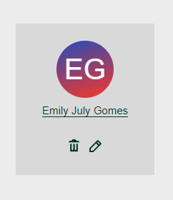
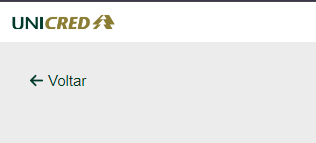

# Cadastro de cooperados

### 🎯Objetivo

Plataforma destinada ao cadastro de cooperados da cooperativa de crédito Unicred. Página desenvolvida usando Vuejs 3, com persistência dos dados em local storage e gerenciamento de estado com Pinia.

### 📑 Regras de negócio

<strong>Campos obrigatórios:</strong>  

- Nome  
- CPF / CNPJ  
- Perfil (Pessoa física/ Pessoa Jurídica)  
- Data de nascimento / Data de constituição

<strong>Campos opcionais:</strong>  

- Telefone de contato  
- Renda / Faturamento

 

<strong>Funcionamento:</strong>  

- Deverá ser possível cadastrar, editar, visualizar e remover um cooperado.  
- Validações necessárias no formulário de cadastro e edição de acordo com a obrigatoriedade dos campos.  
- Controle e persistência do gerenciamento dos usuários deverá acontecer todo no frontend.  
- Cada cadastro deve ter um identificador único (ID).  
- O sistema não pode permitir o cadastro ou edição de um CPF/CNPJ que já exista.  
- A persistência dos dados deve ser feita utilizando controle de estado ou local storage.  
- O campos CPF/CNPJ, Data de nascimento/Data de constituição, Renda/Faturamento devem ser dinâmicos de acordo com o perfil selecionado (Pessoa física/Pessoa jurídica).

### 💻 Tecnologias usadas

- <a href="https://vuejs.org/" target="_blank">Vuejs 3</a>
- <a href="https://vitejs.dev/" target="_blank">Vite</a>
- <a href="https://eslint.org/" target="_blank">ESLint</a> e <a href="https://prettier.io/" target="_blank">Prettier</a> (Organização do código)
- <a href="https://v3.router.vuejs.org/" target="_blank">Vue router 3</a> (Roteamento das páginas)
- <a href="https://vue3datepicker.com/" target="_blank">Vue 3 datepicker</a> (Campos de data do formulário)
- <a href="https://beholdr.github.io/maska/?ref=madewithvuejs.com#/" target="_blank">Maska</a> (Máscara de campos como telefone e CPF/CNPJ)
- <a href="https://pinia.vuejs.org/" target="_blank">Pinia</a> (Gerenciamento de estado)
- <a href="https://sweetalert2.github.io/" target="_blank">Swwet alert 2</a> (Alertas na aplicação)
- <a href="https://www.npmjs.com/package/uuidv4" target="_blank">uuidv4</a> (Geração de ID dos usuários)
- <a href="https://www.typescriptlang.org/" target="_blank">Typescript</a> (Tipagem dos dados)
- <a href="https://www.dicebear.com/" target="_blank"> DiceBear</a> (Geração de avatares pela inicial dos usuário)

### 🔊 Informações adicionais

- Esse projeto possui um protótipo feito em Figma para maior facilidade no desenvolvimento, acesse clicando no ícone do Figma abaixo   
- Esse projeto possui um deploy em produção no Netlify acesse clicando no ícone do Netlify abaixo   

### ⚙️ Como rodar o projeto

- 1 - Clone esse repositório  
  <code>$ git clone https://github.com/emilyjuly/cadastro-cooperados.git</code>
- 2 - Instale as dependências  
  <code>$ npm install</code>
- 3 - Execute a aplicação  
  <code>$ npm run dev</code>

### 🔑 Atalhos

- Visualizar detalhes de cada perfil:
  Clique no nome do usuário em cima do card  
    
- Para voltar para a página de usuários: Clique na logo da aplicação na parte superior da página  
     ou no botão de voltar que existe na parte superior das telas  
  
